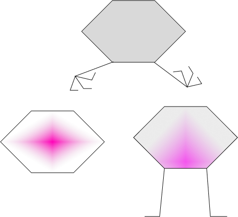

—
tags: js, base
—

# Объект

<Grid>

<div>

<Def>

Объект — это **набор пар ключ-значение**, связанный с прототипом.

</Def>

<Example>

```js
{
  key: 'value',
  __proto__: null
}
```

> Типичный -объект

</Example>

</div>



</Grid>

## 🌿 Свойства
> Каждая пара ключ-значение — определяет свойство (property)

<Adm>

##### `Symbol || String` **🗝️**
**Ключ** свойства может быть только **символом** или **строкой**

</Adm>

### Дескрипторы 🏴
> По мимо значения, каждое свойство объекта имеет дополнительные аттрибуты (флаги), которые называются дескрипторами.

### Значения и аксессоры
[Свойства](#свойства) могут быть *значениями* и *аксессорами*, в зависимости от дескрипторов, которые они содержат.

#### **🚩** Значения
Свойства-значения содержат дескрипторы данных:
- `[[Value]]` — само значение, возвращаемое при обращении к свойству по ключу
  `obj.someProperty` или `obj['someProperty']` вернут значение именно этого дескриптора.
- `[[Writable]]` — флаг, указывающий на возможность изменения свойства

#### **🏁** Аксессоры
Суть свойства-аксессора в дескрипторах доступа, которые определяют функции, вызываемые при попытках получения и записи свойства:
- `[[Get]]` — в этом дескрипторе содержится функция, из которой будет возвращено значение, при обращении к свойству.
- `[[Set]]` — то же самое, только вызывается при изменении свойства.

> Аксессоры используются, для явного управления записью и чтением свойства.

> Например, чтобы выводить дату в определенном формате:
```ts
const entity = {
  set date(value) {
	this._date = value
  },
  get date() {
	return new Intl
		.DateTimeFormat('ru-RU')
		.format(this._date)
  }
}

entity.date = new Date(2022, 11, 22)

console.log(entity.date)
```

### Общие дескрипторы **👭**
- `[[Enumerable]]` — флаг, указывающий, будет ли свойство перечислено в `for...in`
- `[[Configurable]]` — `false` -- св-во не может быть удалено, а его аттрибуты -- изменены

> ### Чтение и запись флагов
> Дескрипторы свойства могут быть установлены через статический метод
> `Object.defineProperty(объект, ключ, флаги)`
```ts
const o = {}
Object.defineProperty(o, 'prop', { 
	value: 8675309, 
	writable: false, 
	enumerable: false 
})

d = Object.getOwnPropertyDescriptor(o, 'baz')
console.log(d)
```
> Для получения дескрипторов свойства используется метод `Object.getOwnPropertyDescriptors(объект, ключ)`


## 👾 Прототип
> — способ реализации наследования в 🐸.

> Каждый объект при создании получает свой **прототип**, который используется как **шаблон** от которого новый объект **наследует** свойства и методы.

> ##### Вот объект без свойств:
```ts
const emptyObj = {}
```
> Не смотря на то, что не установлено ни одного свойства для него, этот объект **не пустой**:

> Чтобы получить действительно пустой объект, придется [модифицировать прототип](#изменение-прототипа)

> ##### Чудесным образом, объект получил прототип. Но как?
> Создание объекта при помощи литерала аналогично использованию конструктора `Object`:
```ts
const emptyObj = new Object()
```
> Поэтому все объекты в JS являются потомками `Object`, а значит, наследуют методы и свойства `Object.prototype`
> ##### Прототип установлен по-умолчанию
> То есть, при создании объекта JS неявно устанавливает ему внутреннее свойство `[[Prototype]]` — ссылку на базовый `Object.prototype`.
> :::adm primary
> Прототипом может быть другой объект или `null` — *последнее звено цепи прототипов*.
> :::


##### `[[Prototype]]`, `__proto__`
`__proto__`— это внутреннее свойство объекта (**экземпляра**), которое содержит ссылку на прототип

> Именно через свойство `__proto__` потомок связан с родителем.

Согласно спецификации, ссылка на прототип объекта должна устанавливаться в приватном свойстве `[[Prototype]]`, взаимодействие с ним осуществляется через `Object.getPrototypeOf()` и `Object.setPrototypeOf()` и `__proto__` — это аксессор, который просто делегирует вызовы этим двум методам.

#### `prototype`
`prototype` есть только у функций-конструкторов!

> — это свойство функции-конструктора (**класса**), содержащее:
    - `__proto__` на ее родителя
    - `constructor` - указатель на саму функцию

`constructor.prototype === instance.__proto__`

### ⛓️ Цепь прототипов
> Если объект-прототип имеет собственный прототип (не  `null`), то образуется цепочка прототипов


##### Динамическая делегация **🎢**
Свойства и методы прототипов **не копируются** при создании объектов, обращение к ним происходит **по ссылке**.
Это дает возможность наследовать **один и тот же** прототип многими объектами.

> Если свойство не найдено в самом объекте, движок попытается достать это свойство из прототипа, затем прототипа прототипа и т.д., до тех пор, пока оно не будет найдено, либо пока не дойдет до конца цепочки — это называется **динамической делегацией**

Если свойство в итоге так и не будет найдено во всей цепочке, то вернется `undefined`

> ### Суть прототипного наследования:
```ts
const base = {
	some: 'property'
}

const derived = Object.create(base, { 
  own: {
	  value: 'property'
  } 
})
```

### Изменение прототипа
##### `obj.__proto__ = parentObj` — антипаттерн **🐛**
Прямое изменение свойства `__proto__` —  чрезвычайно медленная операция.

> Лучше указывать прототип только при создании объекта через `Object.create()` или литерал.

> 💡 Чтобы создать *беспрототипный словарь*, нужно явно установить прототип в `null`
```js
const dict = Object.create(null)
```
> `dict` не наследует ни от кого

## Autoboxing
> Механизм оборачивания примитивных значений в объекты, при обращении к ним, как к объектам.

:::code
```js
1..toString()
```
:::

—

## Тип данных

> Объекты — это особый тип данных.
```ts
const user👨‍🦲 = {
	id: 1,
	name: 'Bob'
}
```
> В отличие от примитивных типов, которые присваиваются идентификаторам как значения, объекты хранятся в памяти отдельно от идентификаторов, которым были присвоены.
```ts
user === { id: 1, name: 'Bob' }
> false ❌
```
> Идентификатор получает значение не самого объекта, а ссылки на него (адрес объекта в памяти). Поэтому при копировании переменной объекта, копируется только ссылка на него, но не сам объект.
```ts
const bob = user
bob.id = 2
user👨‍🦲.id
> 2
```
> Т.к. обе переменные ссылаются на один и тот же объект, при изменении `bob.id`, меняется и `user.id`.

# Задачи
## Копирование
> Создание глубокой независимой копии объекта

> Необходимо создать глубокую независимую копию объекта: все вложенные объекты в копии должны быть независимы от вложенных объектов источника:
```ts

```
> :::adm primary
> В современных браузерах и ноде глубокое копирование можно выполнить проще — при помощи глобального метода **structuredClone**
> :::


# 🍻
- [ECMAScript® 2023 Language Specification](https://tc39.es/ecma262/)
  - [JavaScript. Ядро: 2-ое издание](http://dmitrysoshnikov.com/ecmascript/javascript-the-core-2nd-edition-rus/)